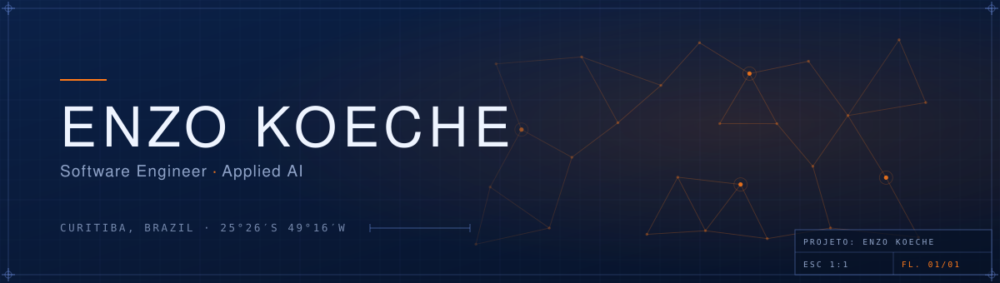
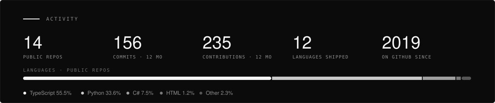

  

I build systems that think — AI agents, data platforms and web products that hold up in production.

Right now: **Applied AI @ [Lyx Engenharia](https://lyx.com.br)**, building internal systems for one of
southern Brazil's largest homebuilders, and **[Milkup](https://milkup.com.br)**, software for dairy
companies. Software Engineering at PUCPR, in Curitiba.

> **New:** my portfolio now runs a retrieval agent **in your browser** — ask it anything about me, it answers with a cited source or an honest *"I didn't find it"*. No server, no API key, your question never leaves the page. → **[enzokoeche.vercel.app/#perguntar](https://enzokoeche.vercel.app/#perguntar)**

---

## How I work

Five things I insist on. Each one has public code proving it isn't just talk.

| | |
|---|---|
| **A system that doesn't know must say so** | Hallucination isn't a model bug, it's an architecture decision. With no retrieved basis, the right answer is *"I didn't find it"* — enforced with a test, not a prompt. → [`rag-conformidade-laticinios`](https://github.com/EnzoKoeche/rag-conformidade-laticinios) |
| **AI supports the decision; a person makes it** | In credit, health or compliance, automating judgement hands responsibility to something that can't carry it. I build with an explicit interrupt for human approval. → [`agente-credito-langgraph`](https://github.com/EnzoKoeche/agente-credito-langgraph) |
| **If you can't measure it, it isn't done** | *"Seems better"* is not a result. Deterministic evals in CI, cost and latency tracked, coverage where the logic is critical. A number nobody verifies is decoration. |
| **Every change needs a way back** | Migration, registry tweak, deploy: if it can't be undone, it isn't done. Nobody gives you a second chance after you break their machine. → [`fpsbooster`](https://github.com/EnzoKoeche/fpsbooster) |
| **Sensitive data doesn't get in without a plan** | Portfolio projects run on synthetic data, and PII in production is handled explicitly — not as a detail to sort out later. A leak has no rollback. |

---

## Selected work

| Project | What it is | Built with |
|---|---|---|
| **[RAG Conformidade Laticínios](https://github.com/EnzoKoeche/rag-conformidade-laticinios)** | Agentic RAG answering dairy-compliance questions with a cited official source — or an honest *"I don't know"*. | `Python` `LangGraph` `RAG` `Streamlit` |
| **[enzokoeche-site](https://github.com/EnzoKoeche/enzokoeche-site)** | This profile's big brother: an engineering sheet with live GitHub telemetry, an in-browser BM25 agent (eval-enforced refusal) and the build's commit printed on the title block. | `Next.js` `TypeScript` `BM25` |
| **[Agente de Crédito](https://github.com/EnzoKoeche/agente-credito-langgraph)** | Consumer-credit analysis agent with typed state, human-in-the-loop and evals that run in CI. | `Python` `LangGraph` `HITL` `Evals` |
| **[ShadowMesh](https://github.com/EnzoKoeche/shadowmesh)** | An AI security control plane: discovers, classifies and governs AI tool usage across an organisation. | `Python` `Security` `Governance` |
| **[Soulstone](https://github.com/EnzoKoeche/soulstone)** | Real-time Steam Market price tracker for the *TBH: Task Bar Hero* community. | `React` `TypeScript` `Supabase` |
| **[Orkestree](https://github.com/EnzoKoeche/Orkestree)** | Web platform with technical docs versioned alongside the code and an external brain in Notion. | `Next.js` `PostgreSQL` `Prisma` |
| **[FPSBooster](https://github.com/EnzoKoeche/fpsbooster)** | FPS and latency optimiser for Windows: detects hardware, suggests tweaks, applies them reversibly. | `C#` `.NET 8` `WPF` |

More, with write-ups → **[enzokoeche.vercel.app](https://enzokoeche.vercel.app)**

---

## Stack

Tools I use often enough to have opinions about.

**Languages**

**AI & Data**

**Web & Backend**

**Data & Infra**

**Mobile & Desktop**

---

## Stats

---

The two images above aren't widgets. The banner is drawn from a fixed seed by
<a href="scripts/gen_banner.py"><code>gen_banner.py</code></a>, and the stats card is redrawn every Monday
from the GitHub API by <a href="scripts/gen_stats.py"><code>gen_stats.py</code></a> and committed here —
the hosted card service was returning 503, and a broken image on a profile is worse than no card.
